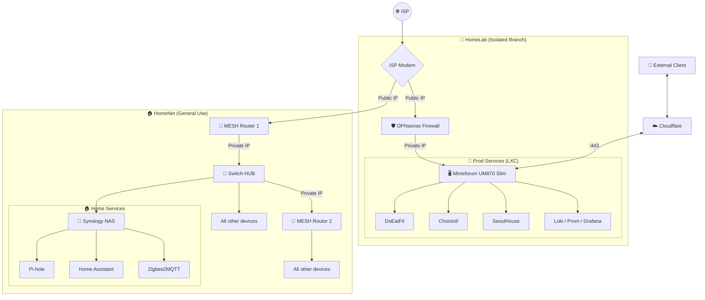

# 🌌 Na Junho (나준호)
### "소프트웨어 개발부터 탄탄한 인프라 구축까지, 경계 없는 최적화를 추구합니다."

  
  
  
  

---

## 👨‍💻 About Me
- 🚀 **Full-Stack Developer**: Spring Boot와 Next.js를 주력으로, 확장 가능하고 유지보수가 쉬운 서비스를 만듭니다.
- 🛡️ **Self-Hoster**: Proxmox 기반의 프라이빗 클라우드를 직접 구축하여 최신 기술들을 실험하고 실제 서비스에 적용합니다.
- ⚡ **Security-Minded**: 네트워크 세분화와 터널링 기술을 통해 보안과 접근성의 균형을 고려한 아키텍처를 지향합니다.

---

## 🛠️ Tech Stack

### ⚙️ Backend

### 🎨 Frontend

### 🗄️ Database & Storage

### 🌐 DevOps & Infrastructure

### 📊 Monitoring & Observability

### 🛠️ Tools & Productivity

---

## 🏗️ Private Infrastructure Architecture
> 보안과 성능의 균형을 위해 논리적으로 분리된 2개의 네트워크 세그먼트를 운영하고 있습니다.

---

## 🚀 Featured Projects

### 🥗 [DoEatFit](http://www.doeatfit.org)
- **Concept**: 개인 맞춤형 식단 추천 및 운동 가이드 웹 애플리케이션
- **Tech Stack**: `Spring Boot`, `Next.js`, `TypeScript`, `React`, `JPA`, `QueryDSL`, `Redis`, `MinIO`, `Meilesearch`, `Grafana`, `Loki`, `Prometheus`, `Tempo`, `MySQL`, `Github Action`
- **Keywords**: #Observability #Optimization #Customization

### 🏗️ [Chois International](http://www.choisintl.co)
- **Concept**: 철강 무역 회사 기업용 반응형 웹사이트
- **Tech Stack**: `Spring Boot`, `Next.js`, `TypeScript`, `React`, `JPA`, `Redis`, `MinIO`, `Swagger`, `Github Action`, `PostgreSQL`
- **Keywords**: #GlobalTrade #ResponsiveWeb #CorporateIdentity

### 🏠 [The Seoul House](http://www.theseoulhouse.com)
- **Concept**: 다국어 지원 및 예약 관리가 가능한 게스트하우스 웹사이트
- **Tech Stack**: `Kotlin`, `Spring Boot`, `Next.js`, `React`, `JPA`, `Redis`, `MinIO`, `TypeScript`, `PostgreSQL`, `GithubAction`
- **Keywords**: #ReservationSystem #Multilingual #KotlinBackend

### 📑 [Flowright](https://github.com/EricNakor/Flowright)
- **Concept**: 노드 기반의 흐름 시각화 및 에디터 도구
- **Tech Stack**: `TypeScript`, `React`, `Tailwind CSS`, `Electron`
- **Keywords**: #FlowEditor #NodeBased #Visualization

---

## 📂 Other Projects
- **DaLabel**: 데이터 라벨링 웹 서비스 (`Java`, `Spring Framework Legacy`)
- **Algorithm & Data Structure**: 백준(BOJ) 문제 풀이 레포지토리 (`Java`)

---

## 📊 Statistics & Activities

---

## ✍️ Latest Blog Posts
<!-- BLOG-POST-LIST:START -->
<!-- BLOG-POST-LIST:END -->

  

---

  

